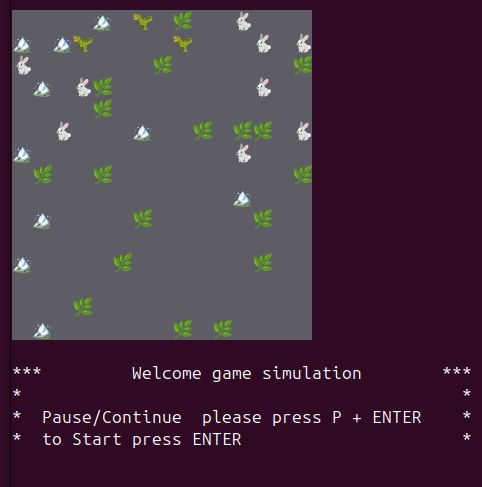
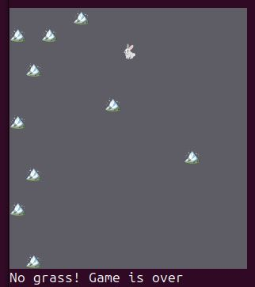

# 02-Project-Simulation
### Simulation - is a step-by-step simulation of a 2D world inhabited many entityes, implemented in OOP style




#### * Herbivores 🐇 can find and eat grass 🌿

#### * Predators 🦖 can find, attack and eat prey


### How to use:
 * System requirements: Gradle 8.5 and Java ver.21
 * Clone the project locally and run:
```shell
make build-run
```

---
Specification is [avalable](https://zhukovsd.github.io/java-backend-learning-course/projects/simulation/)

About [Java-Backend-Learning-course](https://zhukovsd.github.io/java-backend-learning-course/) by Sergey Zhukov

